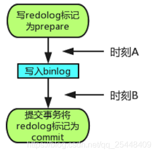

# Mysql 事务

## 什么是事务

**事务就是为了保证一组数据库操作，要么全部成功，要么全部失败。**

事务的特性: ACID

## ACID

### 原子性 (Atomicity)

一个事务中的多组操作，要么全部成功，要么全部失败。在事务提交（commit）成功之后，所有的操作都生效，提交失败，所有的操作都会回滚。

> 利用InnoDB的undo log
> undo log（回滚日志）记录需要回滚的日志信息，是实现原子性的关键，当事务回滚时能够撤销所有已经成功执行的sql语句.

### 一致性 (Consistency)

通过`AIC`保证的

### 隔离性 (Isolation)

> 利用锁和MVCC机制

### 持久化 (Durability)

Mysql为了提升效率采用了 `Buffer Pool` 的更新策略.

两段式提交:



#### 时刻A发生故障

如果时刻B说明 redo log 处于 prepare 阶段，并且 binlog 已经开始持久化。 redo log 还没有 commit 的时候发生崩溃。那么此时就需要分情况。

重启过后InnoDB引擎发现 redo log 是 prepare 阶段，那么就会根据自己的XID去寻找对应的 binlog （XID是他们共同的数据字段）。

#### 时刻B发生故障

如果时刻B说明 redo log 处于 prepare 阶段，并且 binlog 已经开始持久化。 redo log 还没有 commit 的时候发生崩溃。那么此时就需要分情况。

重启过后InnoDB引擎发现 redo log 是 prepare 阶段，那么就会根据自己的XID去寻找对应的 binlog （XID是他们共同的数据字段）。

**1. binlog是完整**
那么此时直接提交事务。

**2. binlog不是完整的**
那么此时回滚事务。

## 事务的隔离级别

当数据库出现有**多个事务同时执行**时，就可能出现`脏读`，`不可重复读`，`幻读`等问题，隔离级别就是为了解决这些问题的。隔离的越严实，效率就越低，并发越低，安全性越高。

### 读未提交

> A事务可以读取B事务未提交的数据

特例1:

```text
A: 启动事务, 查询数据c

B: 启动事务, 更新数据c, 但不提交

A: 再次读取数据c, 发现数据已经被修改了, 这就是所谓的“脏读”

B: 回滚事务

A: 再次读数据, 发现数据变回初始状态
```

### 读已提交

> 只能读到已经提交了的内容, 最常用的一种隔离级别, 也是SQL Server和Oracle的默认隔离级别

#### 如何解决读未提交的?

1. 对更新的数据加写锁, 等事务提交再释放锁;
2. 对于`特例2`的情况, 是用 **快照读（Snapshot Read）** 方式实现的.

特例2:

```text
A: 启动事务, 查询数据c

B: 启动事务, 更新数据c, 但不提交

A: 再次读数据c, 发现数据c未被修改 **Q: 为何读不到已经更新的数据? 是通过“快照读（Snapshot Read）”实现的**

B: 提交事务

A: 再次读取数据c, 发现数据c已发生变化, 说明B提交的修改被事务中的A读到了, 这就是所谓的“不可重复读”
```

### 可重复读

> 专门针对“不可重复读”这种情况而制定的隔离级别, 可以有效的避免“不可重复读”, 是MySql的默认隔离级别。

#### 如何解决不可重复读的?

1. 通过MVCC实现的.

[MVCC原理](/Backend/mysql/MVCC.md)

特例3:

```text
A: 启动事务, 查询数据集{c,d} # 此时d数据还不存在

B: 启动事务, 更新数据c, 但不提交

A: 再次读取数据c, 发现数据c未被修改

B: 提交事务

A: 再次读取数据c, 发现数据c依然未发生变化, 这说明这次可以重复读了

C: 插入一条新的数据d, 并提交

A: 再次读取数据, 发现数据变化为{c, d}, 这就是所谓的“幻读”

A: 提交本次事务
```

### 串行化

> 事务“串行化顺序执行”, 但是执行效率奇差, 性能开销也最大.

## 参考

[MySQL 什么是事务？](https://www.cnblogs.com/hhhhuanzi/p/12296776.html)
[MySQL究竟是如何做到持久性的?](https://blog.csdn.net/qq_25448409/article/details/105376450)
[数据库的4种隔离级别](https://www.cnblogs.com/myseries/p/10748912.html)
[mysql 四种隔离级别](https://www.cnblogs.com/jian-gao/p/10795407.html)
